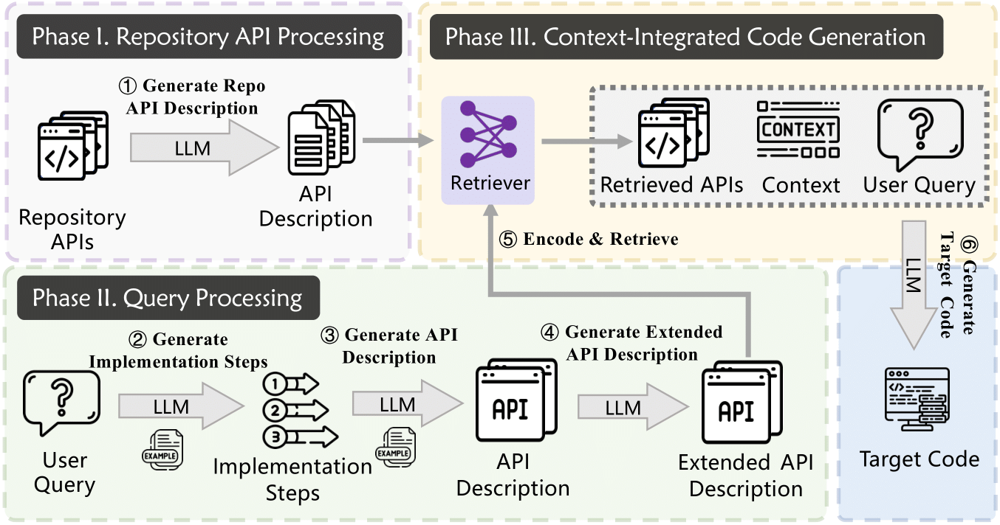

# 🚀 AllianceCoder: What to Retrieve for Effective Retrieval-Augmented Code Generation?   🔍 An Empirical Study and Beyond  

## 🌟 Overview  

🖥️ **AllianceCoder** consists of three key phases:  

  

### 📌 1. Repository API Processing  

✅ We utilize **large language models (LLMs)** to generate **natural language descriptions** for each API present in the repository.  
✅ These descriptions are then **encoded into vector representations** using pre-trained embedding models.  

### 📌 2. Query Processing  

🔍 We guide LLMs with **carefully designed examples** to generate **descriptions of potentially invoked API functionalities**.  
🔍 These descriptions are similarly **encoded into vector representations**.  

### 📌 3. Context-Integrated Code Generation 

🤖 **Relevant APIs are retrieved** based on the **cosine similarity** between their **vector representations**.  
🤖 The retrieved APIs provide **valuable context** for **enhanced code generation**.  

## 📂 Project Structure  

```md
|-- 📁 repo_funcs_summary   # 🛠️ First step: Extract and summarize repository functions
|
|-- 📁 ask_dependencies     # 🔗 Second step: Identify function dependencies
|
|-- 📁 similarity_retrieval  # 🔍 Third step: Retrieve the most relevant APIs
|-- 📁 function_list_buildup # 📜 Build a function list for further reference
|-- 📄 final_completion.py   # 🏗️ Generate complete code using retrieved APIs
|
|-- 🚀 run_pipeline.py       # ▶️ Execute the full pipeline

📁 empirical_study # Code for empierical study mentioned in our paper
|-- 📁API # code for API retrieval and context+API retrieval
|-- 📁LLM # code for context retrieval and only LLM generation(without retrieval)
|-- 📁SimCode # code for similarity retrieval and simCode+context retrieval
|-- 📁SimCode+API # code for SimCode+API retrieval and context+SimCOde+API retrieval
```

## ⚡ QuickStart

### 📝 1. Prepare the Input Files

📌 Ensure you have input.jsonl and the input repository structured correctly in the input folder.
If you want to use RepoExec, CoderEval or ExecRepobench, you can follow the 

### 📦 2. Install Dependencies

Run the following command to install all required packages:

```sh
pip install contexttimer flask transformers_stream_generator colorama accelerate python-Levenshtein tqdm sentence_transformers flash_attn
```

### 📜 3. Prepare repository function extraction

In line 55 of repo_funcs_summary/repo_funcs_extraction.py, change the repo_path string into your repository path.

```python
repo_path = 'input/string_utils' # change your path here
```

### ▶️ 4. Run the Pipeline

```sh
python run_pipeline.py
```

## 📊 Datasets

In our paper, we evaluate AllianceCoder using three function-level Python code generation benchmarks: **RepoExec**, **CoderEval**, and **ExecRepoBench**. Each dataset presents unique challenges relevant to real-world repository-level code completion.

---

### 🧪 **1. RepoExec**

> **Focus:** Repository-level code completion with complex contextual dependencies.

- ✅ Evaluates the ability to generate **functionally correct and executable code** while utilizing **cross-file contexts**.
- 🧩 Each task includes developer-specified **code dependencies** and **comprehensive test cases**.
- 📚 Ideal for assessing how well models understand and integrate repository-wide knowledge.

- 📦 **Dataset**: [Hugging Face – RepoExec](https://huggingface.co/datasets/Fsoft-AIC/RepoExec)  
- 📄 **Paper**: [arXiv:2406.11927v2](https://arxiv.org/abs/2406.11927v2)

---

### 🧪 **2. CoderEval**

> **Focus:** Pragmatic function-level code generation across real-world tasks.

- 🛠️ Contains **230 Python** and **230 Java** tasks sampled from **open-source repositories**.
- 🧾 Each task provides:
  - A **function signature**
  - A **natural language description**
  - A **reference solution**
  - **Unit tests** for functional verification

- 📦 **Dataset**: [GitHub – CoderEval](https://github.com/CoderEval/CoderEval)  
- 📄 **Paper**: [ACM DL](https://dl.acm.org/doi/10.1145/3597503.3623316)

---

### 🧪 **3. ExecRepoBench**

> **Focus:** Code completion benchmark with AST-guided multi-level masking.

- 🧠 Based on **1,200 samples** from real Python repositories.
- 🧩 Simulates **statement**, **expression**, and **function-level** masking guided by **abstract syntax trees (ASTs)**.
- ⚙️ Originally designed for **block completion**; we adapt it for **function-level generation**:
  - Reviewed the **167 test samples**
  - Selected and transformed those suitable into full **function-level generation tasks**

- 📦 **Codebase**: [ExecRepoBench](https://execrepobench.github.io)  
- 📄 **Paper**: [arXiv:2412.11990](https://arxiv.org/abs/2412.11990)  
- 📁 **Modified Data File**: `execrepobench_data.jsonl` (included in this repo)

---