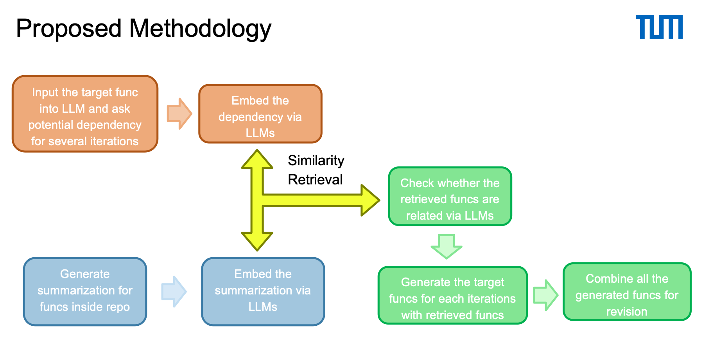

# Large Language Model based Adaptive Code Retrieval for Repository Code Generation

## Overview



1. Provide the Large Model with a Brief Description and Definition of the Target Function:
   1. Give the large language model (LLM) a concise summary comment and the definition of the target function.
   2. Request the model to infer the potential content of the target function and identify other functions that it might call.
2. Summarize Each Function in the Repository:
   1. Ask the LLM to generate summaries for each function within the repository.
   2. These summaries should succinctly describe the purpose and functionality of each function.
3. Encode All Function Information into Vectors and Perform Similarity Retrieval:
   1. Convert all the function summaries in the repository into vector representations.
   2. Use the summary of the target function to perform a similarity search, identifying other functions that are likely to be called by the target function based on their semantic similarity.
4. Verify the Potentially Called Functions with the Large Model:
    1. Utilize the LLM to confirm whether the identified potential functions can indeed be called within the target function context.
    2. This verification should ensure that the functions are compatible and correctly implemented for the intended usage.
5. Complete the Target Function Based on Retrieved Related Functions:
    1. Based on the functions identified through the similarity search and verified by the LLM, ask the model to complete the target function.
    2. Ensure the completed function is coherent, logically correct, and leverages the relevant functions appropriately.

## Project

```md
|-- ask_dependencies #This section is the first step of the above-mentioned procedure. It's output is ask_dependencies/dependencies.txt
|-- exec_first_prompt.py #This python file is to excute the first part of ask_dependencies
|-- exec_second_prompt.py #This python file is to excute the second part of ask_dependencies

|-- repo_funcs_summary #This section is the second step of the above--mentioned procedure. It's output is repo_funcs_summary/function_summaries.json
|-- exec_function_summaries.py #This python file is to excute the the repo_func_summary procedure

|-- similarity_retrieval #This section is the third step of the above--mentioned procedure. It's output is similarity_retrieval/retrieved_functions.json

|-- LLM_doublecheck #This section is the fourth step of the above--mentioned procedure. It's output is LLM_doublecheck/function_list.json

|-- final_completion.py #This python file is the fifth step of the above--mentioned procedure. It's output is result.txt


|-- input #This section contains the target function and the repository where the target function is located in.
```

## QuickStart

```sh
pip install contexttimer flask transformers_stream_generator colorama accelerate python-Levenshtein tqdm sentence_transformers flash_attn

python run_pipeline.py
```
